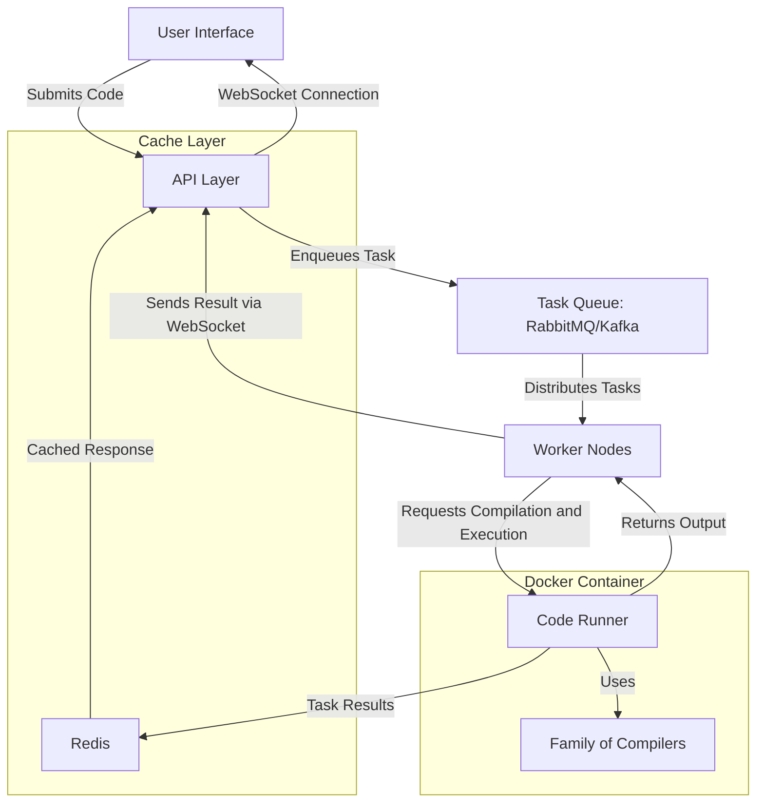
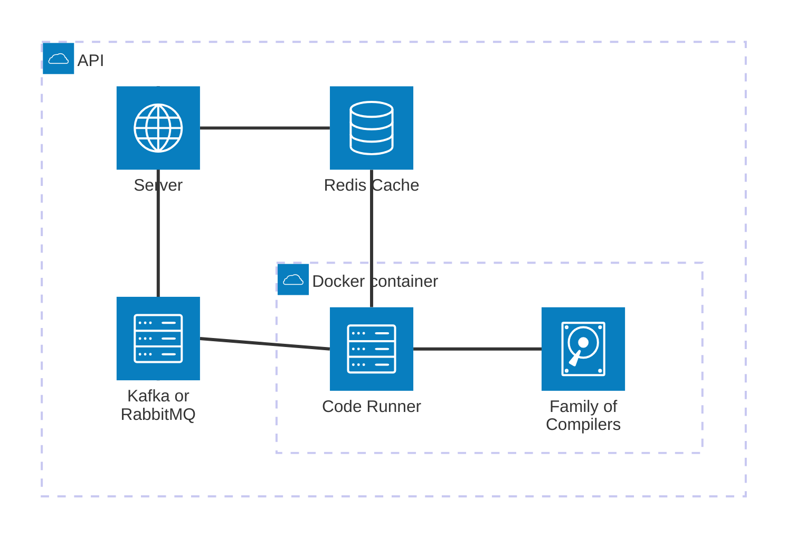

# cpast_api

> Based on [Zero To Production In Rust](https://zero2prod.com), which is an opinionated introduction to backend development using Rust. Highly recommended.

## Pre-requisites

You'll need to install:

- [Rust](https://www.rust-lang.org/tools/install)
- [Docker](https://docs.docker.com/get-docker/)

There are also some OS-specific requirements.

### Windows
  
```bash
cargo install -f cargo-binutils
rustup component add llvm-tools-preview
```

```bash
cargo install --version="~0.8" sqlx-cli --no-default-features --features rustls,postgres
```

### Linux

```bash
# Ubuntu 
sudo apt-get install lld clang libssl-dev postgresql-client
# Arch 
sudo pacman -S lld clang postgresql
```

```bash
cargo install --version="~0.8" sqlx-cli --no-default-features --features rustls,postgres
```

### MacOS

```bash
brew install michaeleisel/zld/zld
```

```bash
cargo install --version="~0.8" sqlx-cli --no-default-features --features rustls,postgres
```

## How to build

Launch a (migrated) Postgres database via Docker:

```bash
./scripts/init_db.sh
```

Launch a Redis instance via Docker:

```bash
./scripts/init_redis.sh
```

Launch `cargo`:

```bash
cargo build
```

You can now try with opening a browser on <http://127.0.0.1:8000/login> after
having launch the web server with `cargo run`.

There is a default `admin` account with password
`everythinghastostartsomewhere`. The available entrypoints are listed in
[src/startup.rs](https://github.com/LukeMathWalker/zero-to-production/blob/6bd30650cb8670a146819a342ccefd3d73ed5085/src/startup.rs#L92)

## Development

Change the LLM API key to Google Gemini API key in `./cpast_api/configuration/base.yaml`.

To ensure you accidently don't push the API key, ignore the changes locally!

```bash
git update-index --assume-unchanged ./cpast_api/configuration/base.yaml
```

## How to test

Launch a (migrated) Postgres database via Docker:

```bash
./scripts/init_db.sh
```

Launch a Redis instance via Docker:

```bash
./scripts/init_redis.sh
```

Launch `cargo`:

```bash
cargo test 
```

## Architecture

### Workflow



### High level architecture



